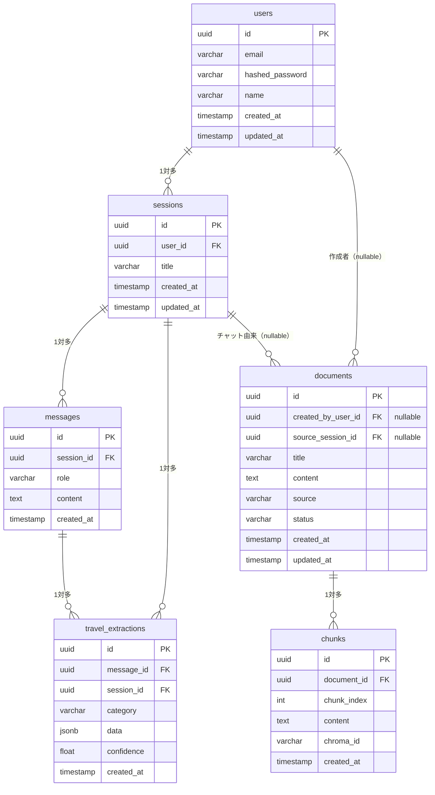

# ユーザーデータ管理 & セッション管理 設計書

> 作成日: 2026-04-27
> ステータス: 設計完了・実装待ち

---

## 概要

認証機能追加（`01_auth_design.md`）に伴い、以下を整備する。

1. **C案 ハイブリッド型ユーザーデータ管理**
   - チャットセッション・メッセージはユーザー専有
   - ドキュメント・ベクトルは全ユーザー共有（出所情報付き）

2. **セッション管理 UI**
   - ChatGPT ライクなサイドバー形式のチャット履歴
   - セッションの作成・切り替え・削除・リネーム

---

## 設計方針

### データの所有区分

| テーブル / ストア | 区分 | 説明 |
|---|---|---|
| `sessions` | **ユーザー専有** | 他ユーザーからは参照不可 |
| `messages` | **ユーザー専有** | セッション経由で紐づく |
| `travel_extractions` | **ユーザー専有** | セッション・メッセージ経由で紐づく |
| `documents` | **共有（出所情報付き）** | 誰でも RAG コンテキストとして参照可能 |
| `chunks` | **共有** | ドキュメント経由で紐づく |
| ChromaDB | **共有** | メタデータに出所情報を格納 |

### RAG の動作方針

- RAG 検索は**全ユーザーのドキュメントを対象**とする（共有知識ベース）
- ユーザーが増えるほど知識ベースが豊かになる設計
- ドキュメントメタデータで「誰のチャット由来か」を追跡可能にする

---

## データモデル変更

### 変更後の ER 図



### カラム追加詳細

#### sessions テーブル

| カラム | 型 | 制約 | 説明 |
|---|---|---|---|
| `user_id` | UUID | NOT NULL, FK → users.id | セッション所有者 |

- タイトルは初回ユーザーメッセージの先頭 40 文字から自動生成
- 既存データの `user_id` は移行戦略を参照

#### documents テーブル

| カラム | 型 | 制約 | 説明 |
|---|---|---|---|
| `created_by_user_id` | UUID | NULLABLE, FK → users.id | 作成者（削除時は NULL に） |
| `source_session_id` | UUID | NULLABLE, FK → sessions.id | チャット由来の場合のセッション |

- `source = 'chat'` → `source_session_id` が埋まる
- `source = 'upload'` / `'manual'` → `created_by_user_id` のみ、`source_session_id` は NULL

#### ChromaDB メタデータ（スキーマ変更なし、付与情報追加）

```python
# ベクトル化時に付与するメタデータ
{
    "document_id": str,
    "chunk_index": int,
    "source": str,                    # 'chat' | 'upload' | 'manual'
    "created_by_user_id": str | None, # 追加
    "source_session_id": str | None,  # 追加
}
```

---

## API 設計

### 既存 API の修正

#### `POST /api/chat`

```
変更点:
- セッション作成時に user_id を自動セット（get_current_user から取得）
- ドキュメント保存時に created_by_user_id・source_session_id をセット
- ChromaDB ベクトル化時にメタデータへ上記を付与
- session_id 未指定時は新規セッションを作成して返す
```

#### `GET /api/chat/history`

```
変更点:
- 自分のセッション以外は 403 を返す（所有者チェック追加）
```

### 新規 API

#### `GET /api/chat/sessions` — セッション一覧取得

```
認証: 必須
レスポンス: ログインユーザーのセッション一覧（更新日時降順）

Response 200:
{
  "sessions": [
    {
      "id": "uuid",
      "title": "京都旅行について",
      "created_at": "2026-04-27T10:00:00",
      "updated_at": "2026-04-27T10:30:00",
      "message_count": 12
    }
  ],
  "total": 5
}
```

#### `POST /api/chat/sessions` — 新規セッション作成

```
認証: 必須
レスポンス: 作成されたセッション

Response 201:
{
  "id": "uuid",
  "title": null,
  "created_at": "2026-04-27T10:00:00",
  "updated_at": "2026-04-27T10:00:00"
}
```

#### `PATCH /api/chat/sessions/{session_id}` — セッション名変更

```
認証: 必須（所有者のみ）
Request:
{
  "title": "新しいタイトル"
}
Response 200: 更新後のセッション
```

#### `DELETE /api/chat/sessions/{session_id}` — セッション削除

```
認証: 必須（所有者のみ）
Response 204: No Content
副作用: messages・travel_extractions は CASCADE で削除
        documents は created_by_user_id・source_session_id を NULL に更新（共有データを保護）
```

---

## フロントエンド設計

### URL 構造

| URL | 説明 |
|---|---|
| `/chat` | 最新セッションへリダイレクト、なければ新規作成 |
| `/chat/[sessionId]` | 特定セッションのチャット画面 |

### 画面構成

```
┌─────────────────┬──────────────────────────────────────┐
│   サイドバー     │         チャットエリア                │
│   (260px)       │                                      │
│                 │  ┌────────────────────────────────┐  │
│ [＋ 新しいチャット]│  │ セッションタイトル               │  │
│ ─────────────── │  └────────────────────────────────┘  │
│ 今日            │                                      │
│  ● 京都旅行      │  メッセージ一覧                       │
│  ○ 沖縄の夏      │  （スクロール可能）                   │
│ 昨日            │                                      │
│  ○ 北海道プラン  │                                      │
│ 先週            │                                      │
│  ○ 台湾グルメ   │  ────────────────────────────────    │
│                 │  [入力フォーム]          [送信ボタン]  │
└─────────────────┴──────────────────────────────────────┘
```

### セッション管理 UI 仕様

- サイドバーのセッションを右クリック or ⋮ メニューで「削除」「名前変更」
- セッション削除は確認ダイアログを表示
- セッション一覧はページネーションなし（全件表示、多くなったら無限スクロール）
- 日付グルーピング: 今日 / 昨日 / 過去7日 / 過去30日 / それ以前

### 新規チャット時のフロー

```
「新しいチャット」ボタンクリック
  → POST /api/chat/sessions でセッション作成
  → /chat/[newSessionId] へ遷移
  → 最初のメッセージ送信時にタイトルを自動生成・更新
```

---

## 実装フェーズ

### フェーズ 1：データモデル（バックエンド）

> **完了条件**: 既存 API が認証済みユーザーのデータのみを扱い、ドキュメントに出所情報が付与されること

1. **Alembic マイグレーション作成・適用**
   - `sessions.user_id` (NOT NULL) ※移行戦略参照
   - `documents.created_by_user_id` (NULLABLE)
   - `documents.source_session_id` (NULLABLE)

2. **モデル更新**
   - `ChatSession`: `user_id` カラム + `user` リレーション追加
   - `Document`: `created_by_user_id`・`source_session_id` + リレーション追加
   - `User`: `sessions` リレーション追加

3. **サービス修正**
   - `chat_service.get_or_create_session()`: `user_id` を受け取るよう変更
   - `chat_service.get_session_history()`: 所有者チェック追加
   - `document_service`: ドキュメント保存時に `created_by_user_id`・`source_session_id` をセット
   - `rag_service`: ChromaDB ベクトル化時にメタデータへ付与

4. **ルーター修正**
   - `POST /api/chat`: `current_user.id` を `get_or_create_session()` に渡す
   - `GET /api/chat/history`: 所有者チェックを追加

5. **テスト更新**
   - セッション所有者チェックのテストを追加
   - ドキュメントメタデータの付与テストを追加

---

### フェーズ 2：セッション管理（バックエンド + フロントエンド）

> **完了条件**: サイドバーで過去のチャット一覧を確認でき、切り替え・新規作成・削除ができること

1. **バックエンド**
   - `GET /api/chat/sessions` 実装
   - `POST /api/chat/sessions` 実装
   - `PATCH /api/chat/sessions/{id}` 実装
   - `DELETE /api/chat/sessions/{id}` 実装（documents の FK を NULL に更新してから削除）
   - セッションタイトル自動生成ロジック（初回メッセージ先頭 40 文字）

2. **フロントエンド**
   - `/chat` を `/chat/[sessionId]` 動的ルートへ変更
   - `SessionSidebar` コンポーネント作成（セッション一覧・新規ボタン）
   - セッション切り替え・削除・リネーム UI
   - `/chat` アクセス時のリダイレクトロジック

---

## 既存データの移行戦略

現在の `sessions` テーブルには `user_id` がない。以下の方針で対処する。

### 開発環境（推奨）
既存のセッション・ドキュメントデータをすべて削除し、マイグレーションで NOT NULL として追加する。

```sql
-- マイグレーション実行前に既存データを削除
TRUNCATE sessions CASCADE;
TRUNCATE documents CASCADE;
```

### 本番環境（将来参考）
1. まず `user_id` を NULLABLE で追加
2. 既存データに管理者ユーザーの ID を割り当て
3. NOT NULL 制約を追加

---

## 関連ドキュメント

- [認証設計書](./01_auth_design.md)
- [ER 図](../db/01_er_diagram.md) ← フェーズ 1 完了後に更新予定
- [チャット API](../api/01_chat_api.md) ← フェーズ 2 完了後に更新予定
