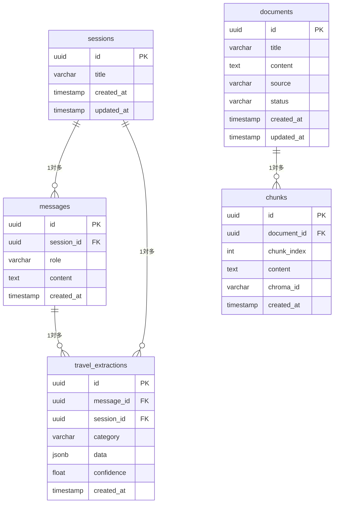

# ER図

> 対象DB: PostgreSQL 15 / `travel_db`
> 最終更新: 2026-04-22

---

---

## ストレージ役割分担

| DB | 保存するもの |
|---|---|
| **PostgreSQL** | セッション・メッセージ・抽出旅行データ・ドキュメントメタデータ・チャンクメタデータ |
| **ChromaDB** | テキストのベクトル（embedding）・チャンク本文・検索フィルタ用メタデータ |

`chunks.chroma_id` で PostgreSQL ↔ ChromaDB を紐づける。
