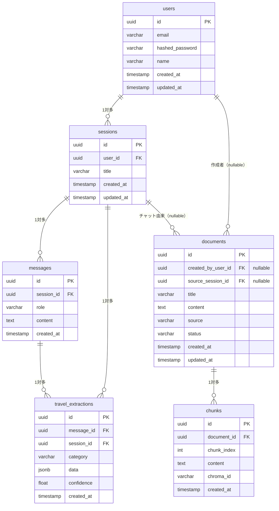

# ER図

> 対象DB: PostgreSQL 15 / `travel_db`
> 最終更新: 2026-04-27

## 変更履歴

| 日付 | バージョン | 変更内容 |
|---|---|---|
| 2026-04-22 | 1.0.0 | 初版作成（sessions / messages / travel_extractions / documents / chunks） |
| 2026-04-27 | 1.1.0 | users テーブル追加・sessions.user_id / documents 出所カラム追加・データ所有区分セクション追加 |

---

---

---

## データ所有区分

| テーブル | 区分 | 説明 |
|---|---|---|
| `users` | — | 認証ユーザー |
| `sessions` | **ユーザー専有** | `user_id` で所有者を紐づけ。他ユーザーからは参照不可 |
| `messages` | **ユーザー専有** | セッション経由で紐づく |
| `travel_extractions` | **ユーザー専有** | セッション・メッセージ経由で紐づく |
| `documents` | **全ユーザー共有** | 出所情報（`created_by_user_id`, `source_session_id`）を保持しつつ RAG に共有 |
| `chunks` | **全ユーザー共有** | ドキュメント経由で紐づく |

---

## ストレージ役割分担

| DB | 保存するもの |
|---|---|
| **PostgreSQL** | ユーザー・セッション・メッセージ・抽出旅行データ・ドキュメントメタデータ・チャンクメタデータ |
| **ChromaDB** | テキストのベクトル（embedding）・チャンク本文・検索フィルタ用メタデータ（`created_by_user_id`, `source_session_id` を含む） |

`chunks.chroma_id` で PostgreSQL ↔ ChromaDB を紐づける。
